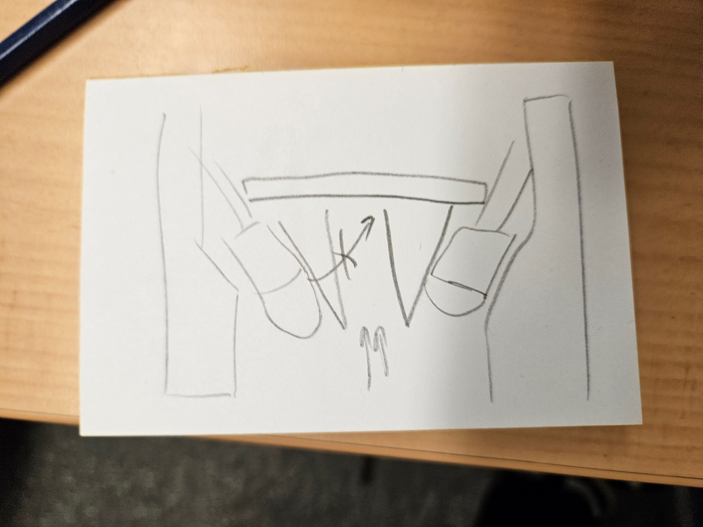

# TODO

- Wie definieren ich bits? bitmasks?? => used to write to

- PS zum laufen bringen..!!!

# VEML3328

## TODO

- White led is not part of the CMOS chip itself => not surprising if its not listed there! => lookup datasheet of sensor board

## pinout veml3328

- SCL => gelb
- SDA => grün
- 3V3 => orange
- 5V => rot
- GND => schwarz

## DONT FORGET

- Spektrum der Bannane im IR-Bereich auch anschauen!
- White LED von Sensor abschranken (3D-Druck??) 
